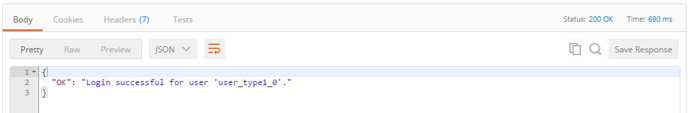

# Medical Record

A POC to evaluate Hyperledger for healthcare domain.


## Versions and Supported Platforms

- [v2.0](https://github.com/ibm-blockchain/learn-chaincode/tree/v2.0)

  - Hyperledger fabric v0.6-developer-preview


--------------------------------------------------------------------------------

# How to make sure it builds in your local environment:

  - Open a terminal or command prompt

  ```bash
  cd $GOPATH/src/github.com/<YOUR_GITHUB_ID_HERE>/med-rec/code
  go build ./
  ```

  - It should compile with no errors/text. 

# Push the changes back to your fork on GitHub.

  ```bash
  cd $GOPATH/src/github.com/<YOUR_GITHUB_ID_HERE>/learn-chaincode/
  # See what files have changed locally.  You should see chaincode_start.go
  git status
  # Stage all changes in the local repository for commit
  git add --all
  # Commit all staged changes.  Insert a short description after the -m argument
  git commit -m "Compiled my code"
  # Push local commits back to https://github.com/<YOUR_GITHUB_ID_HERE>/learn-chaincode/
  git push
  ```


### Secure Enrollment

Calls to the `/chaincode` endpoint of the REST interface require a secure context ID to be included in the body of the request. This means that you must first enroll a user from the user list in the membership service for your network.

- Find an available user to enroll on one of your peers. This will most likely require you to grab a user from the [membersrvc.yaml](https://github.com/hyperledger/fabric/blob/v0.6/membersrvc/membersrvc.yaml#L199) file for your network. Look for the section that has a list of users like this:

  ```
  ...
  test_user0: 1 MS9qrN8hFjlE bank_a        00001
  test_user1: 1 jGlNl6ImkuDo institution_a 00007
  test_user2: 1 zMflqOKezFiA bank_c        00008
  ...
  ```

- Open up a notepad and copy one set of credentials. You will need them later.

  ```
  test_user0 MS9qrN8hFjlE
  ```

- Create a POST request like the example below.

  

  The url indicates that the REST port for one of my Bluemix peers is accessible at `b88037dd5b6d423caf5258c6b7b15f5a-vp3.dev.blockchain.ibm.com:443`. This is the api URL for vp3\. You would find this information on the **Service Credentials** tab of the Blockchain dashboard or the **Network** tab of your Bluemix console. This specific registration is being sent to vp3, but it could be directed at any network peer.

- The body for the request:

  ```json
  {
    "enrollId": "<YOUR_USER_HERE>",
    "enrollSecret": "<YOUR_SECRET_HERE>"
  }
  ```

- Send the request. If everything goes smoothly, you will see a response like the one below

  

  If you didn't receive a "Login successful" response, go back and make sure you properly copied your enrollment ID and secret. Now, you have an ID that you can use when deploying, invoking, and querying chaincode in the subsequent steps.

### Deploying the chaincode

In order to deploy chaincode through the REST interface, you will need to have the chaincode stored in a public git repository. When you send a deploy request to a peer, you send it the url to your chaincode repository, as well as the parameters necessary to initialize the chaincode.

**Before you deploy** the code, make sure it builds locally!

- Open a terminal
- Browse to the folder that contains `chaincode_start.go` and try to build your chaincode:

  ```bash
    cd $GOPATH/src/github.com/<YOUR_GITHUB_ID_HERE>/med-rec/code
    go build ./
  ```

- It should return with no errors/text. This indicates that your chaincode compiled successfully. A good omen.

- Create a POST request like the example below.

  

- **Note**: Be sure to issue your deployment to same peer on which you enrolled your user. In this scenario, it is vp3.

- The body for the request:

  ```json
  {
    "jsonrpc": "2.0",
    "method": "deploy",
    "params": {
      "type": 1,
      "chaincodeID": {
        "path": "https://github.com/<YOUR_GITHUB_ID_HERE>/learn-chaincode/finished"
      },
      "ctorMsg": {
        "function": "init",
        "args": [
          "hi there"
        ]
      },
      "secureContext": "<YOUR_USER_HERE>"
    },
    "id": 1
  }
  ```

- The `"path":` is the path to your fork of the repository on Github, going one more directory down into `/finished`, where your `chaincode_finished.go` file lives.

- Send the request. If everything goes smoothly, you will see a response like the one below

  

The long string response for the deployment will contain an ID that is associated with this chaincode. The ID is a 128 character alphanumeric hash. Copy this ID on your notepad as well. You should now have a set of enrollID credentials and the cryptographic hash representing your chaincode. This is how you will reference the chaincode in any future Invoke or Query transactions.

### Query

Next, let's query the chaincode for the value of `hello_world`, the key we set with the `Init` function.

- Create a POST request like the example below.

  

- The body for the request:

  ```json
  {
    "jsonrpc": "2.0",
    "method": "query",
    "params": {
      "type": 1,
      "chaincodeID": {
        "name": "<CHAINCODE_HASH_HERE>"
      },
      "ctorMsg": {
        "function": "read",
        "args": [
          "hello_world"
        ]
      },
      "secureContext": "<YOUR_USER_HERE>"
    },
    "id": 2
  }
  ```

- Send the request. If everything goes smoothly, you will see a response like the one below

  

Hopefully you see that the value of `hello_world` is "hi there", as you specified in the body of the deploy request.

### Invoke

Next, call your generic `write` function by invoking your chaincode and changing the value of "hello_world" to "go away".

- Create a POST request like the example below.

  

- The body for the request:

  ```json
  {
    "jsonrpc": "2.0",
    "method": "invoke",
    "params": {
      "type": 1,
      "chaincodeID": {
        "name": "<CHAINCODE_HASH_HERE>"
      },
      "ctorMsg": {
        "function": "write",
        "args": [
          "hello_world", "go away"
        ]
      },
      "secureContext": "<YOUR_USER_HERE>"
    },
    "id": 3
  }
  ```

- Send the request. If everything goes smoothly, you will see a response like the one below:

  

- Test if our change stuck by sending another query like the one from before.

  

That's all it takes to write basic chaincode.
